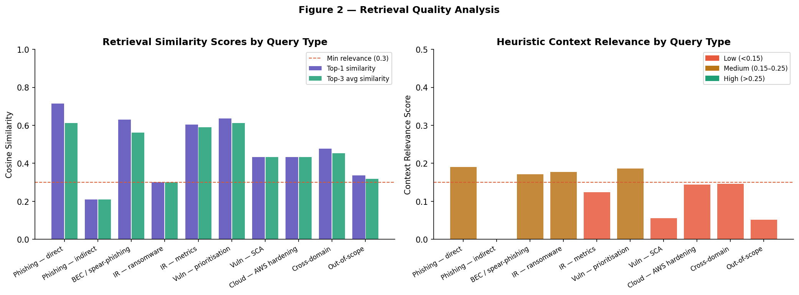
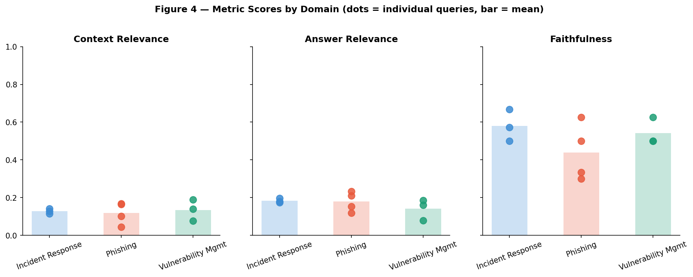

# Cybersecurity Guidelines RAG Pipeline

 

A retrieval-augmented generation (RAG) system that answers practitioner questions on **phishing, incident response and vulnerability management** with three numbered, source-grounded guidelines, plus an evaluation harness that scores context relevance, answer relevance and faithfulness.

## Architecture

```
question ─► embed (all-MiniLM-L6-v2) ─► ChromaDB (cosine, top-k=3) ─► prompt with sourced context
                                                                          │
              scores ◄── evaluation (heuristic + optional DeepEval) ◄── Mistral-7B-Instruct (Ollama)
```

| Stage | Implementation |
|---|---|
| Knowledge base | Curated cybersecurity passages modelled on NIST SP 800-61r2 / 800-177, CISA advisories, OWASP and ISO 27001 guidance (`src/knowledge_base.py`); a generator for a 2,000+ chunk corpus (`src/build_large_kb.py`) |
| Chunking | Overlapping word windows (300 words / 50 overlap for the default KB) |
| Retrieval | `sentence-transformers` embeddings, persistent ChromaDB collection, optional metadata filter; FAISS alternative |
| Generation | Mistral-7B-Instruct via a local Ollama server, HuggingFace pipeline fallback, mock generator for offline demos |
| Evaluation | Reference-free heuristic scorers (token-overlap / cosine based) and optional DeepEval metrics |

## Results

Benchmark: 10 practitioner questions (4 phishing, 3 incident response, 3 vulnerability management), generated with Mistral-7B via Ollama (mean latency 4.9 s/query on local hardware). Raw outputs are in [`results/`](results/).

| Metric (heuristic) | Mean | Std | Min | Max |
|---|---|---|---|---|
| Context relevance | 0.127 | 0.041 | 0.045 | 0.188 |
| Answer relevance | 0.169 | 0.043 | 0.079 | 0.234 |
| Faithfulness | 0.512 | 0.114 | 0.300 | 0.667 |
| Composite | 0.270 | 0.048 | 0.165 | 0.335 |




**How to read these numbers:** the scores come from lexical-overlap heuristics, which are deliberately conservative proxies, not LLM-judged RAGAS scores, so absolute values are low and are not comparable to published RAG benchmarks. They are useful for *relative* comparison between queries and configurations. Faithfulness is clearly highest for incident-response questions and lowest for phishing questions, and the probe in `results/retrieval_quality.csv` shows weak retrieval (top-1 cosine similarity of 0.21) for an indirectly-phrased phishing query. That is the clearest failure case.

## Run it

```bash
pip install -r requirements.txt
python run_pipeline.py --generator mock        # offline, no LLM needed
ollama pull mistral && python run_pipeline.py  # with the local Mistral model
python src/build_large_kb.py && python run_pipeline.py --kb large
pytest -q                                      # offline smoke tests
```

Outputs go to `outputs/` (git-ignored) so the committed `results/` stay intact.

## Project structure

```
src/            knowledge_base.py, retrieval.py, generation.py, evaluation.py, build_large_kb.py
run_pipeline.py end-to-end runner
tests/          offline smoke tests (hashing embedder + mock generator)
results/        evaluation CSV/JSON and figures from the benchmark run
```

## Limitations and next steps

- The knowledge base is synthesised from public guidance rather than parsed from the original documents; a production system would ingest the official PDFs.
- Only 10 benchmark queries and heuristic metrics, with no human evaluation. Next: a larger gold set and LLM-as-judge (DeepEval/RAGAS) scoring.
- Dense retrieval only. Hybrid BM25 + dense search and a cross-encoder reranker are the obvious fixes for the weak-retrieval cases.

## Background

Originally built for the *Advanced Topics in AI & ML* course at Adelaide University and refactored for portfolio use. Assignment briefs, rubrics and course materials are not included.

## Author

Akshay Kumar Gandla, MSc AI & ML, Adelaide. Released under the [MIT License](LICENSE).
